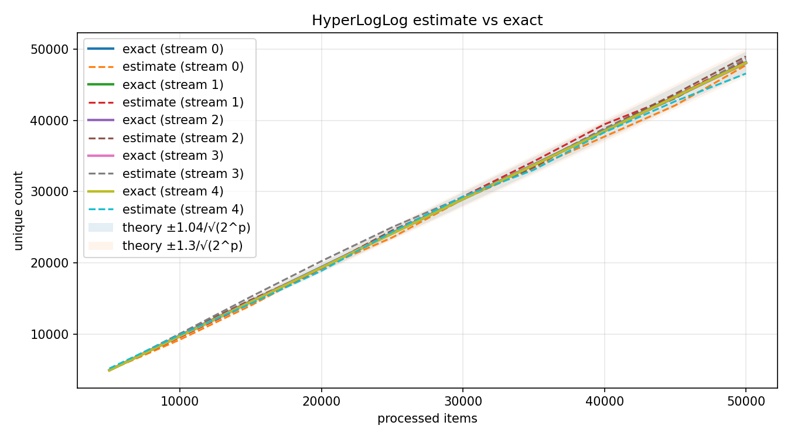
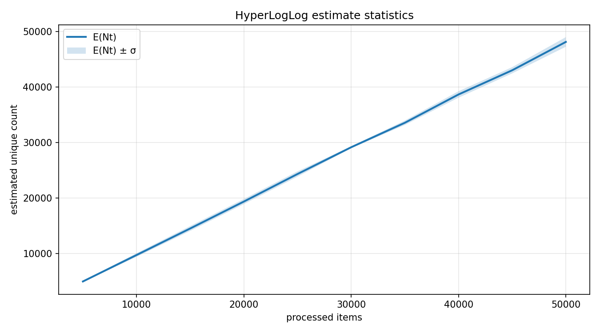

# Выводы

## Структура проекта

- random_stream_gen.h: генерация потока строк и разбиение по шагам
- hash_func_gen.h: 64-битный хеш для строк
- hyperloglog.h: реализация HyperLogLog
- hll_experiment.cpp: генерация статистик и данных в формате csv
- plot_hll.py: построение графиков из csv
- graph1_data.csv, graph2_stats.csv: данные для графиков
- graph1.png, graph2.png: визуализация результатов

## Тип хеша

Используется 64-битный хеш на основе двух потоков FNV-подобного смешивания
с финализатором. Это дает достаточно равномерное
распределение значений для бакетов HyperLogLog.

## Графики

График №1. Сравнение точной оценки и результата алгоритма HyperLogLog

График №2. Расхождение стандартного отклонения и мат. ожидания

## Точность и соответствие теории

- Теоретическая относительная погрешность HyperLogLog оценивается как $1.04 / \sqrt{2^p}$.
	Для $p = 10$ это $1.04 / 32 = 3.25\%$.
- Проверка по более консервативной оценке $1.3 / \sqrt{2^p}$ дает порог $4.06\%$ для $p = 10$.
- Для практического сравнения используется относительная ошибка $|N_t - F_{0}^t| / F_{0}^t$ на каждом шаге. На графике №1 можем видеть, что точки укладываются в эти диапазоны, даже когда $F_{0}^t$ не слишком мал.

## Стабильность оценок

- Теоретически $\sigma_{N_t} \approx \text{RSE} \cdot F_{0}^t$, то есть стандартное отклонение
	растет примерно пропорционально истинному числу уникальных элементов.
- На графике №2 виден очень медленный рост дисперсии по мере увеличения количества уникальных значений

## Влияние выбранных констант

- Параметр $p$ задает число регистров $m = 2^p$: увеличение $p$ уменьшает дисперсию
	как $1 / \sqrt{m}$, но увеличивает память линейно. При $p = 10$ регистров 1024.
- Константы эксперимента: total_items = 50000, step_percent = 10, streams = 5, p = 10.
- Проверка равномерности распределения для $p = 8, 10, 12$ показывает ровную
	картину без экстремальных выбросов, что говорит о приемлемом качестве хеша:
	- p=8 m=256 min=57 mean=78.12 max=112
  	- p=10 m=1024 min=8 mean=19.53 max=44
  	- p=12 m=4096 min=0 mean=4.88 max=25

## Итого

Для выбранного $p = 10$ ожидаемая точность соответствует диапазону $[1.04/\sqrt{2^p}, 1.3/\sqrt{2^p}]$,
и результаты эксперимента соотносятся с теоретической оценкой, а стабильность оценок
согласована с теоретическим ростом дисперсии.
